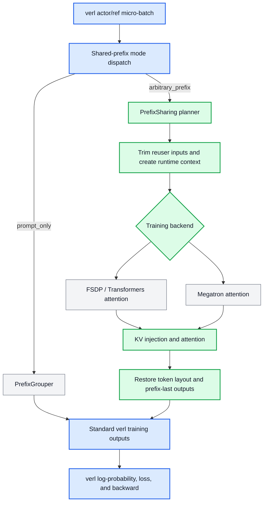

# [RFC][Draft] Arbitrary-Prefix Sharing for RL Training

## 1. Summary

GRPO, step-wise RL, and tree-structured agent training often place trajectories with identical token prefixes in the same batch. Standard actor and reference-policy training recomputes those prefixes for every trajectory.

We propose extending verl's existing PrefixGrouper feature from prompt-only sharing to **arbitrary-prefix sharing within a micro-batch**. The current PrefixSharing prototype uses differentiable KV injection, supports FSDP/Transformers and Megatron, and is designed to preserve baseline logits, log-probabilities, loss, and gradients.

Prototype: https://github.com/Jackie2049/PrefixSharing/tree/open-source

## 2. Motivation

Shared-prefix redundancy appears in several RL trajectory structures, with different requirements on the sharing algorithm.

### 2.1 GRPO-style trajectories

```text
trajectory 0: [prompt P][response A]
trajectory 1: [prompt P][response B]
trajectory 2: [prompt P][response C]
```

All trajectories share one prompt and diverge once. This is the workload that PrefixGrouper already handles well: one explicit prompt group is transformed into one prefix plus multiple suffixes. PrefixSharing supports this case, but does not aim to replace PrefixGrouper's simpler and more efficient prompt-only path.

### 2.2 StepRL-style trajectories

Step-wise RL can sample or optimize continuations from intermediate reasoning steps:

```text
trajectory 0: [prompt P][step 1][step 2A]
trajectory 1: [prompt P][step 1][step 2B]
trajectory 2: [prompt P][step 1][step 2A][step 3A]
trajectory 3: [prompt P][step 1][step 2A][step 3B]
```

There are multiple reusable prefixes: `[P]`, `[P, step 1]`, and `[P, step 1, step 2A]`. Their lengths differ, and a trajectory that reuses one prefix can become the provider of a longer prefix. A single `one prompt + many responses` group cannot express all these chained relationships at once. PrefixSharing detects provider/reuser relationships at arbitrary token boundaries and reuses each available prefix within the same forward.

### 2.3 TreeRL-style trajectories

Tree-search and multi-turn agent RL naturally produce nested branches:

```text
                         /-- [turn 2A] -- [leaf A]
[root][turn 1 shared] --+
                         \-- [turn 2B] -- [leaf B]
                                           \-- [turn 3B] -- [leaf C]
```

Different subsets of leaves share different ancestors. Flattening the leaves into independent sequences repeatedly computes the root and every internal branch. PrefixSharing represents these nested relationships as a provider/reuser plan, allowing internal tree nodes to be reused without requiring the workload to collapse into one prompt group.

Inference prefix caches do not solve this training-side problem. Actor updates and reference log-probability computation require differentiable execution, correct token-level outputs, and gradients through the shared prefix computation.

## 3. Design

### 3.1 Goals

- Reuse arbitrary shared prefixes within one micro-batch. The logical plan and activation-store abstraction are designed so that sharing can later be extended across micro-batches, but cross-micro-batch lifetime and scheduling are outside the first upstream scope.
- Preserve baseline forward and backward semantics. The optimized computation is mathematically equivalent to independent full-sequence forwards, and tests verify attention outputs, logits, log-probabilities, loss, and gradients against the baseline within dtype-appropriate numerical tolerance.
- Extend the existing PrefixGrouper user-facing feature in verl 0.8.0 instead of adding a competing top-level switch. Users can select the existing prompt-only PrefixGrouper algorithm or the arbitrary-prefix PrefixSharing algorithm according to their trajectory structure.
- Keep logical prefix relationships independent from the physical attention implementation.
- Upstream the FSDP/Transformers path first and retain Megatron as another backend.

### 3.2 Non-goals for the first upstream contribution

- Cross-micro-batch activation sharing.
- Context parallelism and every fused attention kernel.
- DeltaNet or other recurrent-state reuse.
- Upstreaming FSDP, Megatron, MindSpeed, and NPU support at the same time.
- Guaranteeing speedup for every batch composition or prefix ratio.

### 3.3 Overview



Node colors indicate code ownership: blue marks verl integration touchpoints, green marks the self-contained PrefixSharing module, and gray marks existing components reused by the integration.

The proposed verl integration follows five steps:

1. **Prepare the verl micro-batch.** The actor or reference-policy path provides token sequences and masks using the normal verl batch contract.
2. **Select the sharing algorithm.** `prompt_only` keeps the existing PrefixGrouper path; `arbitrary_prefix` invokes PrefixSharing. The feature remains opt-in and the baseline path is unchanged when disabled.
3. **Build the logical plan.** PrefixSharing detects shared token ranges, selects providers and reusers, trims duplicated reuser inputs, and records the output positions that must be restored.
4. **Execute through the model backend.** A per-forward runtime context carries the plan into supported FSDP/Transformers or Megatron attention modules. The attention path stores provider KV and injects it when computing each reuser suffix, without detaching the autograd graph.
5. **Return the standard verl outputs.** PrefixSharing reconstructs the token layout and prefix-last boundary outputs before verl computes log-probabilities, loss, and backward. Downstream verl training logic continues to consume its existing output contract.

The plan describes logical sharing semantics, while each backend owns its physical tensor layout and attention implementation. This keeps the verl-facing interface stable and leaves room for future sparse/tree-attention or cross-micro-batch execution strategies.

### 3.4 Integration

We propose a backward-compatible extension of the existing PrefixGrouper configuration:

```yaml
actor_rollout_ref:
  actor:
    use_prefix_grouper: true
    prefix_grouper:
      mode: arbitrary_prefix
```

The exact naming is open for discussion. The first upstream path would integrate with verl's FSDP model engine and Transformers attention dispatch. Megatron support can follow separately after the common interface stabilizes.

### 3.5 Attention

The KV-injection backend follows three rules:

1. **One forward graph:** provider and reuser sequences remain in the same differentiable forward.
2. **KV reuse without `detach()`:** reusers attend to provider prefix KV plus their own suffix KV, and gradients flow through the provider computation.
3. **Prefix-last restore:** trimming a reuser prefix removes the output needed for its first suffix-token log-probability. The backend restores that boundary output before verl consumes token-level results.

These rules are the precision boundary of the design. Performance optimizations must not change them.

## 4. Current Results

The implementation and evaluation are still being consolidated. This section will be updated with the reproducible minimal report before the RFC is opened for community review.

### 4.1 Correctness

Initial FSDP and Megatron validation covers:

| Stage | Compared values | Status |
|---|---|---|
| Internal forward | Attention output and prefix/suffix boundaries | Initial validation passed |
| Training output | Logits and token log-probabilities | Initial validation passed |
| Backward | Loss, parameter gradients, and gradient norms | Initial validation passed |

The final report will add exact model and environment revisions, dtype, tolerance, maximum absolute/relative differences, and prompt-only/arbitrary-prefix/no-sharing test cases.

### 4.2 Performance

Systematic FSDP measurements are in progress. The report will compare baseline and PrefixSharing under identical configurations and include:

- no-sharing, low-sharing, and high-sharing batches;
- actor forward/backward and end-to-end step time;
- throughput and peak memory;
- prefix detection/planning and KV construction overhead.

Current profiling indicates that no-sharing planning and physical expanded-KV construction are the main optimization targets. No final speedup claim is made in this draft.

## 5. Related Works

- [PrefixGrouper](https://github.com/CASIA-IVA-Lab/PrefixGrouper) provides differentiable prompt-level sharing and the existing verl-facing integration model. This proposal extends the sharing granularity to arbitrary prefixes.
- Prefix-tree shared attention systems use flat deduplicated token layouts and sparse/custom attention masks. We view this as a complementary execution backend to KV injection.
- [Tree Training](https://arxiv.org/abs/2511.00413) studies tree-structured RL training and broader model architectures.
- [AReaL dynamic tree attention](https://github.com/areal-project/AReaL/tree/feat/dta) focuses on scalable tree execution and load balancing.
- vLLM and SGLang prefix caches optimize inference/rollout execution; PrefixSharing targets differentiable actor and reference-policy training.

## 6. Future Plans

1. Complete and publish the minimal FSDP correctness and performance report.
2. Finalize a PrefixGrouper-compatible logical metadata and configuration interface with community feedback.
3. Submit the FSDP/Transformers path with tests, documentation, and a reproducible example.
4. Optimize KV construction or add a sparse/tree-attention backend where supported.
5. Add Megatron and additional parallel strategies after the shared interface is stable.
6. Explore cross-micro-batch sharing and recurrent-state reuse as separate future work.
