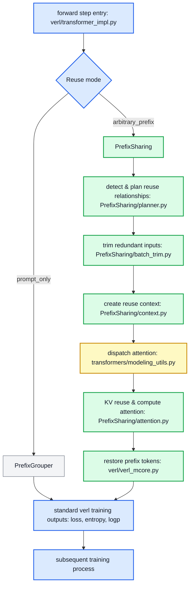

# [RFC] Integrate PrefixSharing to verl: Generalizing PrefixGrouper for Arbitrary-Prefix Reuse in Agentic RL Training

## 1. Summary

**Prefix repetition across trajectories is prevalent** in Agentic RL scenarios, especially in GRPO, Step-wise, and Tree-structure rollout paradigms. Current training workflow always recomputes these prefix sub-sequences separately for different trajectories (during compute_old_log_prob & update_actor), resulting in redundant memory overhead and computational cost.

This issue proposes **PrefixSharing to extend verl's existing PrefixGrouper from fixed-length prompt reuse to arbitrary-length prefix sharing**, enabling better support for Step-wise and Tree-structure rollout trajectories. The key mechanism is to construct a prefix tree for input batches, then reuse KV activations during attention computation while preserving baseline logits, LogP, loss and gradient precisions. The current PrefixSharing has improved training throughput by xxx and reduced memory consumption by yyy.

Prototype: https://github.com/Jackie2049/PrefixSharing/tree/open-source

## 2. Concepts

* **Provider**: A trajectory sample whose prefix is shared and reused by reuser samples within the same batch.
* **Reuser**: A trajectory who reuses providers' prefix. Note that a reuser can also be other reusers' provider in complex scenarios.

## 3. Motivation

Prefix redundancy appears in 3 typical rollout paradigms, with different requirements on prefix reuse algorithm.

### 3.1 GRPO-style trajectories

```text
trajectory 0: [prompt P][response A] <--- reward 0
trajectory 1: [prompt P][response B] <--- reward 1
trajectory 2: [prompt P][response C] <--- reward 2
```

This is the simplest reuse workload, where all trajectories share fix-length prompts (_'prompt P'_) and their responses diverge (_'response A/B/C'_). verl's existing PrefixGrouper splits attention into two stages (prompt & response) to enable prompt-only prefix reuse. PrefixSharing also supports prompt reuse by prefix tree algorithm, but DOES NOT aim to replace PrefixGroupers's simpler and more efficient path.

### 3.2 Step-style trajectories

```text
trajectory 0: [prompt P][step 1][step 2A] <--- reward 0        
trajectory 1: [prompt P][step 1][step 2B] <--- reward 1
trajectory 2: [prompt P][step 1][step 2A][step 3A] <--- reward 2
trajectory 3: [prompt P][step 1][step 2A][step 3B] <--- reward 3
trajectory 4: [prompt P][step 1][step 2A][step 3A][step 4A] <--- reward 4
```

Step-wise rollout generates trajectories where some of them (_'trajectory 0'_) are sub-sequence and history steps of the others (_'trajectory 2/3'_). In this scenario, prefix lengths differ from one to another, and a trajectory that reuses prefix can also become provider of longer prefix for subsequent trajectories (**'trajectory 0' => 'trajectory 2' => 'trajectory 4'**). PrefixGrouper is not able to express such chained reusing relationship and fails to reuse prefix longer than prompt, while PrefixSharing handles this easily by a Trie.

### 3.3 Tree-style trajectories

```text
                         /-- [turn 2A] -- [leaf A]
[root][turn 1 shared] --+
                         \-- [turn 2B] -- [leaf B]
                                           \-- [turn 3B] -- [leaf C]

trajectory 0: [root][turn 1 shared][turn 2A][leaf A] <--- reward 0
trajectory 1: [root][turn 1 shared][turn 2B][leaf B] <--- reward 1
trajectory 2: [root][turn 1 shared][turn 2B][turn 3B][leaf C] <--- reward 1
```

Tree-structure rollout produces branches with common ancestors and it is similar with Step-wise rollout from the view of trajectories. Common ancestors of leaves (_'[turn 1 shared][turn 2B]'_) are naturally common prefix among trajectories (_'trajectory 1'_ & _'trajectory 2'_). Currently verl and PrefixGrouper does not support reusing arbitray prefix in Tree-structure trajectories. 

## 4. Design

### 4.1 Scope

- Support arbitrary prefix reuse within micro-batch.
- Performance improvement (less memory consumption or faster forward).
- Preserve baseline forward and backward semantics. Compuatation precision aligned.
- Inherit and extend PrefixGrouper's interface in verl. **Minimal modification to verl**.
- FSDP/transformers as training engine andfor the first version.
- Support full attention (e.g. Qwen-2/2.5/3) and THD format for the first version.

### 4.2 Overview



verl + FSDP + PrefixSharing walkthrough:

1. **verl enters forward_step()**: Branch to PrefixGrouper/PrefixSharing according to `prefix_grouper.mode`.
2. **prompt-only → PrefixGrouper**: For `mode=prompt_only`, PrefixGrouper is enabled for fixed-length prompt reuse.
3. **arbitrary-prefix → PrefixSharing**: For `mode=arbitrary_prefix`, PrefixSharing is enabled for general prefix resuse.
4. **PrefixSharing: detect & plan reuse**: Detect reuse relationships using Trie and emit a provider/reuser plan.
5. **PrefixSharing: trim redundant inputs**: Physically trim reusers' prefix tokens from the batch. They will not be computed.
6. **PrefixSharing: create reuse context**: Create a runtime context that carries necessary information for prefix reuse.
7. **transformers: dispatch attention**: transformers routes each layer via `ALL_ATTENTION_FUNCTIONS` to attention functions.
8. **PrefixSharing: KV reuse & attention**: Reuse prefixes' KV (by concat or crafted attention mask) and compute attention.
9. **PrefixSharing: restore prefix tokens**: Restore prefix tokens in reuser after `prepare_model_outputs()`.
10. **verl obtains loss and continue**: `loss`/`log_probs`/`entropy` are same as baseline; verl continues subsequent process.

### 4.3 Integration

Currently we try to keep verl impact minimal: only 3 files will be changed. Core operations for prefix reuse should stay in the PrefixSharing package. Tighter integration can follow up later as verl and PrefixSharing evolve. 

PrefixSharing plugs into verl as a **mode extension of PrefixGrouper**, not a parallel training entry. The first upstream PR targets the FSDP / Transformers path. Prototype code today reaches the same surfaces via external monkey-patches; the upstream form replaces those patches with thin in-tree hooks and keeps PrefixSharing algorithm logic in an external package.

**verl + FSDP + PrefixSharing — expected modifications to verl**

| file & function | modification |
|---|---|
| `workers/config/actor.py`<br>`ActorConfig` | Keep `use_prefix_grouper` as the enable switch. Add more fields to `prefix_grouper`, e.g. `mode`. |
| `workers/engine/fsdp/transformer_impl.py`<br>`FSDPEngineWithLMHead.forward_step()` | Branch on `prefix_grouper.mode`: `prompt_only` keeps existing PrefixGrouper path; `arbitrary_prefix` goes to PrefixSharing. |
| `models/transformers/monkey_patch.py`<br>`apply_prefix_grouper_patch()` | Extend existing PrefixGrouper wrappers so attention routes to PrefixSharing KV reuse when its context is active; inactive context remains a zero-overhead passthrough. |

**verl + Megatron-LM + PrefixSharing (not first PR) — expected modifications to verl**

| file & function | modification |
|---|---|
| `workers/config/actor.py`<br>`ActorConfig` | Keep `use_prefix_grouper` as the enable switch. Add more fields to `prefix_grouper`, e.g. `mode`. |
| `workers/engine/megatron/transformer_impl.py`<br>`MegatronEngineWithLMHead.forward_step()` | Branch on `prefix_grouper.mode`: `prompt_only` keeps existing PrefixGrouper path; `arbitrary_prefix` goes to PrefixSharing. |
| `workers/engine/megatron/transformer_impl.py`<br>`vocab_parallel_log_probs_from_logits()` | Restore prefix tokens for reusers to preserve same outputs as baseline. |

### 4.4 Enablement and Configuration

We propose a backward-compatible extension of the existing PrefixGrouper configuration, and the naming is open for discussion.

```yaml
actor_rollout_ref:
  actor:
    use_prefix_grouper: true
    prefix_grouper:
      mode: arbitrary_prefix # arbitraray_prefix  → PrefixSharing; prompt_only → PrefixGrouper
```

## 4. Current Results

The implementation and evaluation are still being consolidated. This section will be updated with the reproducible minimal report before the RFC is opened for community review.

### 4.1 Correctness

Initial FSDP and Megatron validation covers:

| Stage | Compared values | Status |
|---|---|---|
| Internal forward | Attention output and prefix/suffix boundaries | Initial validation passed |
| Training output | Logits and token log-probabilities | Initial validation passed |
| Backward | Loss, parameter gradients, and gradient norms | Initial validation passed |

The final report will add exact model and environment revisions, dtype, tolerance, maximum absolute/relative differences, and prompt-only/arbitrary-prefix/no-sharing test cases.

### 4.2 Performance

Systematic FSDP measurements are in progress. The report will compare baseline and PrefixSharing under identical configurations and include:

- no-sharing, low-sharing, and high-sharing batches;
- actor forward/backward and end-to-end step time;
- throughput and peak memory;
- prefix detection/planning and KV construction overhead.

Current profiling indicates that no-sharing planning and physical expanded-KV construction are the main optimization targets. No final speedup claim is made in this draft.

## 5. Roadmap

Roadmap:
1. Optimize prefix-reuse performance (KV concat → FlexAttention → MagiAttention).
2. Fully support Megatron-LM, including DP, TP, PP, and CP (partially already implemented).
3. Support pre-defined reuse plan from user / rollout engine / verl.
4. Support BSHD format.
5. Support more complex attention structures (Qwen3.5 HybridAttention; DeepSeek SWA / CSA / HCA).
6. Support prefix reuse across micro-batches.

## 6. TODO

TODO:
1. Attach a minimal report into this RFC (including precision & performance results).
2. Discuss with community developers and maintainers.
3. Revise the design based on community feedback.
4. Convert PrefixSharing's verl monkey-patches into in-tree hooks and open a PR.
