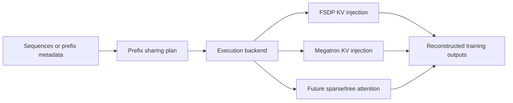

# [RFC] Integrate PrefixSharing to verl: Generalizing PrefixGrouper for Arbitrary-Prefix Reuse in Agentic RL Training

## 1. Summary

**Prefix repetition across trajectories is prevalent** in Agentic RL scenarios, especially in GRPO, Step-wise, and Tree-structure rollout paradigms. Current training workflow always recomputes these prefix sub-sequences separately for different trajectories (during compute_old_log_prob & update_actor), resulting in redundant memory overhead and computational cost.

This issue proposes **PrefixSharing to extend verl's existing PrefixGrouper from fixed-length prompt reuse to arbitrary-length prefix sharing**, enabling better support for Step-wise and Tree-structure rollout trajectories. The key mechanism is to construct a prefix tree for input batches, then reuse KV activations during attention computation while preserving baseline logits, LogP, loss and gradient precisions. The current PrefixSharing has improved training throughput by xxx and reduced memory consumption by yyy.

Prototype: https://github.com/Jackie2049/PrefixSharing/tree/open-source

## 2. Concepts

* **Provider**: A trajectory sample whose prefix is shared and reused by reuser samples within the same batch.
* **Reuser**: A trajectory who reuses providers' prefix. Note that a reuser can also be other reusers' provider in complex scenarios.

## 3. Motivation

Prefix redundancy appears in 3 typical rollout paradigms, with different requirements on prefix reuse algorithm.

### 3.1 GRPO-style trajectories

```text
trajectory 0: [prompt P][response A] <--- reward 0
trajectory 1: [prompt P][response B] <--- reward 1
trajectory 2: [prompt P][response C] <--- reward 2
```

This is the simplest reuse workload, where all trajectories share fix-length prompts (_prompt P_) and their responses diverge (_'response A/B/C'_). verl's existing PrefixGrouper splits attention into two stages (prompt & response) to enable prompt-only prefix reuse. PrefixSharing also supports prompt reuse by prefix tree algorithm, but DOES NOT aim to replace PrefixGroupers's simpler and more efficient path.

### 3.2 Step-style trajectories

```text
trajectory 0: [prompt P][step 1][step 2A] <--- reward 0        
trajectory 1: [prompt P][step 1][step 2B] <--- reward 1
trajectory 2: [prompt P][step 1][step 2A][step 3A] <--- reward 2
trajectory 3: [prompt P][step 1][step 2A][step 3B] <--- reward 3
trajectory 4: [prompt P][step 1][step 2A][step 3A][step 4A] <--- reward 4
```

Step-wise rollout generates trajectories where some of them (_'trajectory 0'_) are sub-sequence and history steps of the others (_'trajectory 2/3'_). In this scenario, prefix lengths differ from one to another, and a trajectory that reuses prefix can also become provider of longer prefix for subsequent trajectories (**'trajectory 0' => 'trajectory 2' => 'trajectory 4'**). PrefixGrouper is not able to express such chained reusing relationship and fails to reuse prefix longer than prompt, while PrefixSharing handles this easily by a Trie.

### 3.3 Tree-style trajectories

```text
                         /-- [turn 2A] -- [leaf A]
[root][turn 1 shared] --+
                         \-- [turn 2B] -- [leaf B]
                                           \-- [turn 3B] -- [leaf C]

trajectory 0: [root][turn 1 shared][turn 2A][leaf A]
trajectory 1: [root][turn 1 shared][turn 2B][leaf B]
trajectory 2: [root][turn 1 shared][turn 2B][turn 3B][leaf C]
```

Tree-structure rollout produces branches with common ancestors and it is similar with Step-wise rollout from the view of trajectories. Common ancestors of leaves (_'[turn 1 shared][turn 2B]'_) are naturally common prefix among trajectories (_'trajectory 1'_ & _'trajectory 2'_). Currently verl and PrefixGrouper does not support reusing arbitray prefix in Tree-structure trajectories. 

## 4. Design

### 4.1 Scope

- Support arbitrary prefix reuse within micro-batch.
- Performance improvement (less memory consumption or faster forward).
- Preserve baseline forward and backward semantics. Compuatation precision aligned.
- Inherit and extend PrefixGrouper's interface in verl. **Minimal modification to verl**.
- FSDP/transformers as training engine for the first version.
- Support full attention (e.g. Qwen-2/2.5/3) for the first version.

### 3.3 Overview



The prefix plan describes provider/reuser relationships and prefix lengths. Execution backends decide how those relationships are implemented. This allows KV injection and future sparse/tree attention to share one logical interface without forcing the same tensor layout.

### 3.4 Integration

3.4.1 代码集成：PrefixSharing和verl的集成关系
3.4.2 参数集成、快速使用

We propose a backward-compatible extension of the existing PrefixGrouper configuration:

```yaml
actor_rollout_ref:
  actor:
    use_prefix_grouper: true
    prefix_grouper:
      mode: arbitrary_prefix
```

The exact naming is open for discussion. The first upstream path would integrate with verl's FSDP model engine and Transformers attention dispatch. Megatron support is also ready and can follow separately after the common interface stabilizes.

### 3.5 Attention

The KV-injection backend follows three rules:

1. **One forward graph:** provider and reuser sequences remain in the same differentiable forward.
2. **KV reuse without `detach()`:** reusers attend to provider prefix KV plus their own suffix KV, and gradients flow through the provider computation.
3. **Prefix-last restore:** trimming a reuser prefix removes the output needed for its first suffix-token log-probability. The backend restores that boundary output before verl consumes token-level results.

These rules are the precision boundary of the design. Performance optimizations must not change them.


### 3.2 Non-goals for the first upstream contribution => Roadmap

- Cross-micro-batch activation sharing.
- Context parallelism and every fused attention kernel.
- DeltaNet or other recurrent-state reuse.
- Upstreaming FSDP, Megatron, MindSpeed, and NPU support at the same time.
- Guaranteeing speedup for every batch composition or prefix ratio.
1、支持Megatron模型并行。支持NPU等设备；
2、未来支持自定义prefix-reuse关系；
3、支持其他注意力；
4、性能优化（build_kv）；
5、支持BSHD；

## 4. Current Results

The implementation and evaluation are still being consolidated. This section will be updated with the reproducible minimal report before the RFC is opened for community review.

### 4.1 Correctness

Initial FSDP and Megatron validation covers:

| Stage | Compared values | Status |
|---|---|---|
| Internal forward | Attention output and prefix/suffix boundaries | Initial validation passed |
| Training output | Logits and token log-probabilities | Initial validation passed |
| Backward | Loss, parameter gradients, and gradient norms | Initial validation passed |

The final report will add exact model and environment revisions, dtype, tolerance, maximum absolute/relative differences, and prompt-only/arbitrary-prefix/no-sharing test cases.

### 4.2 Performance

Systematic FSDP measurements are in progress. The report will compare baseline and PrefixSharing under identical configurations and include:

- no-sharing, low-sharing, and high-sharing batches;
- actor forward/backward and end-to-end step time;
- throughput and peak memory;
- prefix detection/planning and KV construction overhead.

Current profiling indicates that no-sharing planning and physical expanded-KV construction are the main optimization targets. No final speedup claim is made in this draft.

## 5. Related Works

- [PrefixGrouper](https://github.com/CASIA-IVA-Lab/PrefixGrouper) provides differentiable prompt-level sharing and the existing verl-facing integration model. This proposal extends the sharing granularity to arbitrary prefixes.
- Prefix-tree shared attention systems use flat deduplicated token layouts and sparse/custom attention masks. We view this as a complementary execution backend to KV injection.
- [Tree Training](https://arxiv.org/abs/2511.00413) studies tree-structured RL training and broader model architectures.
- [AReaL dynamic tree attention](https://github.com/areal-project/AReaL/tree/feat/dta) focuses on scalable tree execution and load balancing.
- vLLM and SGLang prefix caches optimize inference/rollout execution; PrefixSharing targets differentiable actor and reference-policy training.

## 6. 实施事项

1、monkey patch => verl侵入式修改 => PR；
2、根据社区反馈修改方案、代码；
3、官话；

1. Complete and publish the minimal FSDP correctness and performance report.
2. Finalize a PrefixGrouper-compatible logical metadata and configuration interface with community feedback.
3. Submit the FSDP/Transformers path with tests, documentation, and a reproducible example.
4. Optimize KV construction or add a sparse/tree-attention backend where supported.
5. Add Megatron and additional parallel strategies after the shared interface is stable.
6. Explore cross-micro-batch sharing and recurrent-state reuse as separate future work.
